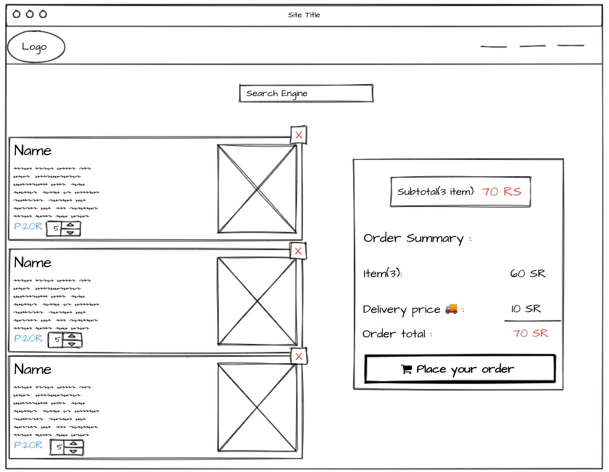

# Description

website for compare delivery price from  alot of delivery food  Apps, that you can order your favorite food and get it deliverd to wherever you are from any delivery food  Apps you want. 

# User Story
- **Visitor:**

  the visitor can browse between alot of delivery company and their restaurant **but** he can't order unless he register or login. 

- **SignUp:**
1. Single User : The user can Register to my website ,so that he can start order,user able to serach between alot of restaurant and see their offer. 
2. Restaurant : The Restaurant can Register to my website ,so that he can start Adding, Updating and Delete item in his restaurant menu.

- **LogIn:**
1. Login User : if user already signup he can login directly to make his order,user able to serach between alot of restaurant and see their offer.

2. Login Restaurant : if user already signup he can login directly to do CRUD for his menu

- **LogOut:**
  A user or restaurant con logout from the website by click logout Button

- **Company Category:**
1. Jahez
2. Hunger Station
3. To You

- **Resturant:**
for each company it has own Restaurants.

- **Resturant Menu:**
Each restaurant has own category.

# Models
### Refrance:
| Models | Refrance of |
| --- | --- |
| Role | -  |
| User | Ref: Role , Ref :Restaurant
| Company | Ref: Restaurants
| Restaurant | Ref: Food Menu  |
| Order | Ref: Company , Ref: User  |
| Food Menu | -  |

### Models Keys:
| Models | Keys |
| --- | --- |
| Role | Name, Permission  
| User | UserName, email,password,Role,Location 
| Company | name, Restaurants, offers
| Restaurant |name, Category ,Menu,Pic, Delivery price  |
| Order | UserId, CompanyId  |
| Food Menu | Name, Pic, desc, Category |

# ER-Digram

#

# Backend routes
| HTTP Method | URL | Success status | Error Status |  For How
| ---         |     ---      |          --- |          --- |          --- |
| Post   | `/login`     | 200    | 400   | User , Admin, Company
| Post     | `/signUp`      |201     | 400   |User , Admin, Company
| Post    | `/additem`       |201     | 400 |Admin, Company
| Post     | `/addRest`       |201     | 400|Company
| get     | `/getRest`       |200     | 400 |User , Admin, Company
| get     | `/users`       |200     | 400 |Admin
| get   |`/cart`|200     | 400  |User 
| get     | `/order`       |200     | 400|User
| delete     | `/user/id `      |200     | 400|Admin
| delete     | `/delRest/id`       |200 | 400 | Company
| Put     | `/edititem/id`       |200| 400 | Company
| Put     | `/editRest/id`       |200| 400 |User , Admin, Company
# UML-Digram

# WireFrame
### Main Page

### When Click on **Show offers**

### Chose the Restaurant

### Your Cart

# Upload our Work on github:

| Command | Description |
| --- | --- |
| git add . | add our work  |
| git commit | add comment before upload it staged 
| git push | Upload it to your github Repo

# Links:

1. Link to Trello board => https://trello.com/b/0o0jzsX9/mp-project-eyad

2. My github Page => https://github.com/Eyad911

3. Link to my presentation=> https://eyad.com